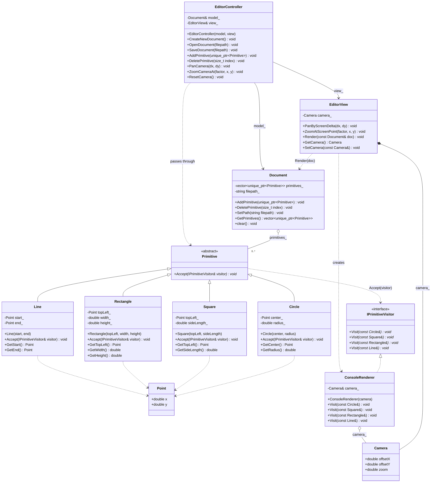

# ot-editor

A simple 2D primitive editor, built in C++20 around an MVC architecture with a
visitor-based rendering pipeline.

## Building

```bash
cmake -S . -B build
cmake --build build
```

This produces the `ot-editor` executable. A Debian package can also be
generated via CPack (`cpack --config build/CPackConfig.cmake`).

## Architecture

The editor follows the **Model-View-Controller** pattern:

- **Model** — `Document` owns the collection of primitives that make up a
  drawing.
- **View** — `EditorView` holds the `Camera` (pan/zoom state) and renders the
  document by dispatching to a `ConsoleRenderer`.
- **Controller** — `EditorController` mediates between the model and view,
  exposing operations like opening/saving documents, adding/removing
  primitives, and panning/zooming the camera.

Shapes (`Circle`, `Square`, `Rectangle`, `Line`) all derive from the abstract
`Primitive` base class and are rendered using the **Visitor** pattern:
`ConsoleRenderer` implements `IPrimitiveVisitor`, and each primitive's
`Accept()` method dispatches to the matching `Visit()` overload.

## Class diagram


